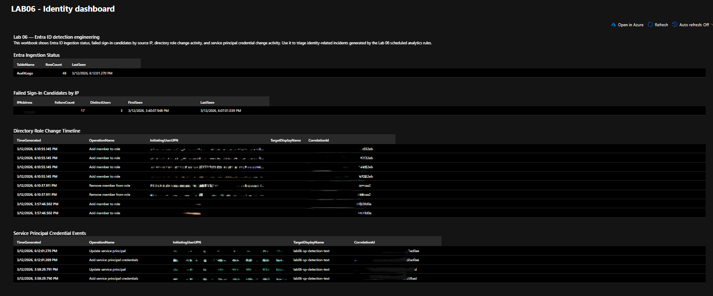

# Lab 06 — Microsoft Entra ID Detection Engineering + Gated Sentinel Content-as-Code Pipeline

## What this lab proves

- I validated Microsoft Entra ID telemetry in Microsoft Sentinel before I wrote detections, instead of assuming the data was already there.
- I built and tested identity-focused KQL against real Entra activity, including failed sign-in bursts, directory role changes, and service principal credential changes.
- I turned the strongest hunts into scheduled analytics with MITRE mapping, entity mapping, incident creation, and exported rule artifacts.
- I added a lightweight response layer with an automation rule and a focused workbook so the lab shows a usable analyst workflow, not just isolated query screenshots.
- I exported the content as code and carried it through OIDC-backed validation, packaging, ARM `what-if`, approval gating, and deployment to a separate Sentinel test workspace.

This lab closes the Entra-focused detection engineering gap in the portfolio and carries the content-as-code work through a gated test deployment.

## Scenario and scope

This is an identity detection engineering lab built in Microsoft Sentinel. It is not a report-only write-up and it is not pretending to be a full production release program.

The goal was to show that I can take Entra telemetry from connector validation through hunt development, scheduled analytics, incident handling, workbook presentation, and code-based content exports that can be reviewed and deployed in a controlled way.

The lab centers on three primary scenarios:

1. A failed sign-in burst from one source IP across multiple users  
2. A directory role assignment change involving the Security Reader role  
3. A service principal credential addition on a dedicated lab service principal  

I used one authoring workspace for building and validating the content and a separate test workspace for the gated deployment proof.

## Data sources used

Primary Entra tables used in this lab:

- `AuditLogs`
- `SigninLogs`
- `AADServicePrincipalSignInLogs` for connector and table validation where applicable

The detections in this lab rely mainly on:

- `SigninLogs` for failed sign-in burst logic and the related success-after-failure hunt
- `AuditLogs` for directory role assignment changes
- `AuditLogs` for service principal credential changes

## Workflow

I kept the workflow simple and deliberate:

1. **Validate telemetry first**  
   Confirm the Entra connector was enabled and prove the required tables were populated before writing detection logic.

2. **Build the hunts around real activity**  
   Run each identity scenario in a controlled way, then verify the exact fields and `OperationName` values that showed up in the tenant.

3. **Promote stable logic into analytics**  
   Convert the strongest hunts into scheduled analytics with thresholds, MITRE mapping, entity mapping, and incident creation enabled.

4. **Add investigation and response context**  
   Create one automation rule and one workbook so the lab shows how an analyst would review and triage the results.

5. **Export the content as code**  
   Save the analytics, automation, and workbook artifacts in repo-safe JSON so the work is reviewable and reusable.

6. **Validate, package, and deploy the content into a test workspace**  
   Use GitHub OIDC, a smoke-test, PR validation, package output, ARM `what-if`, approval gating, and a controlled test deployment to prove the content path end to end without overstating it.

## Key findings

### Failed sign-in burst activity was easy to isolate in `SigninLogs`

The hunt surfaced one IP failing against multiple lab users inside a short window. That gave me a clean identity detection candidate with straightforward tuning logic and an easy explanation for reviewers.

Related proof:
- `screenshots/04_failed_signin_burst_hunt.png`
- `screenshots/05_success_after_failure_burst_hunt.png`

### A later success from the same IP added useful investigation context

I kept the success-after-failure logic as hunt material instead of making it the flagship scheduled rule. It is valuable context during triage, but the failed-burst analytic was the cleaner operational detection.

Related proof:
- `screenshots/05_success_after_failure_burst_hunt.png`

### Directory role changes produced a high-value audit signal

The role-assignment scenario generated clear `AuditLogs` events tied to privilege changes. That made it a strong identity detection with obvious control-plane relevance.

Related proof:
- `screenshots/06_role_assignment_hunt.png`
- `screenshots/09_rule_role_assignment_change.png`
- `screenshots/11_identity_incident_triggered.png`

### Service principal credential changes added cloud identity depth

The service principal scenario produced the paired audit events I expected for credential changes. That gave the lab a stronger cloud-identity angle than a sign-in-only build.

Related proof:
- `screenshots/07_sp_credential_addition_hunt.png`
- `screenshots/10_rule_sp_credential_addition.png`
- `screenshots/11_identity_incident_triggered.png`

## Detections shipped

### LAB06 - Failed sign-in burst by IP

**Purpose**  
Detect repeated failed Microsoft Entra interactive sign-ins from a single IP across multiple users within a short time window.

**Why it matters**  
It is a strong identity detection for password-spraying or brute-force style activity, and it is easy to explain in both technical and hiring contexts.

**Artifacts**
- `kql/analytics/failed_signin_burst_by_ip.kql`
- `detections/docs/01_failed_signin_burst_by_ip.md`
- `detections/exports/analytics/rule_failed_signin_burst.json`

**Proof**
- `screenshots/08_rule_failed_signin_burst.png`

### LAB06 - Directory role assignment change

**Purpose**  
Detect Microsoft Entra directory role assignment or role membership changes that may increase privilege or support persistence.

**Why it matters**  
It is a clean `AuditLogs` signal with obvious security impact and very little ambiguity about why it matters.

**Artifacts**
- `kql/analytics/directory_role_assignment_change.kql`
- `detections/docs/02_directory_role_assignment_change.md`
- `detections/exports/analytics/rule_role_assignment_change.json`

**Proof**
- `screenshots/09_rule_role_assignment_change.png`

### LAB06 - Service principal credential addition

**Purpose**  
Detect the addition of a new password credential to a Microsoft Entra service principal.

**Why it matters**  
It adds modern cloud identity depth and shows awareness of persistence through app and service principal changes.

**Artifacts**
- `kql/analytics/service_principal_credential_addition.kql`
- `detections/docs/03_service_principal_credential_addition.md`
- `detections/exports/analytics/rule_sp_credential_addition.json`

**Proof**
- `screenshots/10_rule_sp_credential_addition.png`

## Automation shipped

I kept the response layer intentionally light.

The automation rule triggers when a Lab 06 incident is created and adds the `lab06-identity` label so identity incidents are easier to triage consistently.

**Artifacts**
- `automation/exports/identity-triage-automation.export.json`

**Proof**
- `screenshots/12_automation_rule_identity_triage.png`

## Workbook shipped

The workbook is intentionally compact. The point was to give an analyst one place to review the most relevant identity signals, not to build a giant dashboard for its own sake.

It includes:

- Entra ingestion status
- failed sign-in candidates by IP
- directory role change activity
- service principal credential events

**Artifacts**
- `kql/workbook/01_ingestion_status.kql`
- `kql/workbook/02_failed_signin_candidates.kql`
- `kql/workbook/03_role_change_timeline.kql`
- `kql/workbook/04_sp_credential_events.kql`
- `workbooks/exports/identity_dashboard.json`

**Proof**
- `screenshots/13_workbook_identity_dashboard.png`

## Pipeline and gated deployment

I kept the deployment claim narrow. This is a gated test deployment path for Sentinel content, not a multi-environment release platform.

The OIDC and pipeline work produced proof at each stage: federated credential configuration, GitHub environment protection, approval gating, Azure login, test workspace access, PR validation, package generation, ARM `what-if`, deploy success, and post-deploy inventory in the test workspace.

**Artifacts**
- `notes/oidc-setup.md`
- `pipeline/manifests/content-manifest.json`
- `pipeline/deploy/main.bicep`
- `pipeline/deploy/workbook.serialized.json`
- `pipeline/parameters/test.parameters.json`
- `artifacts/whatif-evaluation.json`
- `artifacts/deployment-result.json`
- `artifacts/post-deploy-inventory.txt`
- `dist/latest-package.txt`

**Proof**
- `screenshots/14_azure_portal_federated_credential.png`
- `screenshots/15_github_environment.png`
- `screenshots/16_environment_approval_gate.png`
- `screenshots/17_oidc_rbac_assignment.png`
- `screenshots/18_oidc_smoke_test_login_success.png`
- `screenshots/19_oidc_active_account_confirmed.png`
- `screenshots/20_oidc_smoke_test_rg_confirmed.png`
- `screenshots/21_pr_validation_checks.png`
- `screenshots/22_package_dist_artifact.png`
- `screenshots/23_deploy_approval_gate.png`
- `screenshots/24_arm_whatif_output.png`
- `screenshots/25_test_workspace_deploy_success.png`
- `screenshots/26_test_workspace_content_inventory.png`

## MITRE mapping

I mapped the detections to identity-relevant ATT&CK techniques and avoided forcing coverage that the lab did not actually demonstrate.

Current mappings include:

- **T1110** — brute-force or password-spraying style behavior
- **T1098** — account manipulation through role membership changes
- **T1098.001** — additional cloud credentials through service principal credential changes

**Artifact**
- `mitre/mitre_mapping.md`

## IOC and observable handling

This lab leans more on identity observables than traditional host-based IOCs.

Tracked observables include:
- the source IP used during failed sign-in testing
- the lab user identities involved in the burst scenario
- the role-target account used in the role assignment scenario
- role-change correlation identifiers
- service principal credential-change correlation identifiers
- the service principal display name used in the test scenario

**Artifact**
- `ioc/identity_observables.csv`

## Notes and constraints

A few boundaries matter here:

- `AuditLogs` were the hard requirement. If `SigninLogs` had not been available, the lab would have shifted to an audit-heavy fallback instead of pretending sign-in visibility existed.
- `SigninLogs` showed a licensing warning in the connector flow, but the data still arrived and was usable for the sign-in scenarios.
- The success-after-failure logic was useful hunt material, but I kept the primary scheduled detections focused on the cleaner signals.
- The automation rule is intentionally simple. I did not turn this into a Logic App orchestration or ticketing integration project.
- The workbook is intentionally small. Analyst usefulness mattered more than dashboard sprawl.
- The lab supports a strong content-as-code story, but it does not claim a finished enterprise CI/CD program or mature multi-environment release engineering setup.

## Hiccups that mattered

These were the real points that changed the build path or forced validation changes:

- The lab moved from the university tenant to a personal tenant because the original tenant blocked the required user and admin workflow.
- Audit-based hunts needed wider windows than expected before the final time ranges were stable.
- The Security Reader validation flow had to use Microsoft Graph via `az rest`, not Azure RBAC deletion.
- The deploy path needed two corrections before it succeeded: stale deploy parameters and a mismatched `evaluate_whatif.py` call shape.

## What I would improve next

If I extend this lab, the next steps are:

1. Add stricter tuning and exclusion handling for shared NAT or proxy noise in the failed sign-in rule  
2. Add a second audit-heavy follow-on detection for policy or authentication-method changes  
3. Record the final cleanup state after temporary lab users, credentials, and assignments are removed  
4. Surface the package and deploy proof even earlier in the repo so the workflow outcome is harder to miss on a quick skim  

## Reproduction notes

At a high level, this lab can be reproduced by:

1. enabling the Microsoft Entra connector in Sentinel  
2. validating `AuditLogs` and `SigninLogs` ingestion  
3. executing the three controlled identity scenarios  
4. building the raw hunts first  
5. promoting stable hunt logic into scheduled analytics  
6. creating one automation rule and one workbook  
7. exporting the resulting Sentinel content as repo-safe artifacts  
8. validating, packaging, and deploying the content into a separate test workspace through an approval gate  

Detailed execution notes live in:
- `notes/licensing-and-fallback.md`
- `notes/scenario-execution.md`
- `notes/redactions.md`
- `notes/oidc-setup.md`

## Artifact index

### Screenshots
- `screenshots/01_entra_connector_enabled.png`
- `screenshots/02_auditlogs_validation.png`
- `screenshots/03_signinlogs_validation.png`
- `screenshots/04_failed_signin_burst_hunt.png`
- `screenshots/05_success_after_failure_burst_hunt.png`
- `screenshots/06_role_assignment_hunt.png`
- `screenshots/07_sp_credential_addition_hunt.png`
- `screenshots/08_rule_failed_signin_burst.png`
- `screenshots/09_rule_role_assignment_change.png`
- `screenshots/10_rule_sp_credential_addition.png`
- `screenshots/11_identity_incident_triggered.png`
- `screenshots/12_automation_rule_identity_triage.png`
- `screenshots/13_workbook_identity_dashboard.png`
- `screenshots/14_azure_portal_federated_credential.png`
- `screenshots/15_github_environment.png`
- `screenshots/16_environment_approval_gate.png`
- `screenshots/17_oidc_rbac_assignment.png`
- `screenshots/18_oidc_smoke_test_login_success.png`
- `screenshots/19_oidc_active_account_confirmed.png`
- `screenshots/20_oidc_smoke_test_rg_confirmed.png`
- `screenshots/21_pr_validation_checks.png`
- `screenshots/22_package_dist_artifact.png`
- `screenshots/23_deploy_approval_gate.png`
- `screenshots/24_arm_whatif_output.png`
- `screenshots/25_test_workspace_deploy_success.png`
- `screenshots/26_test_workspace_content_inventory.png`

### KQL
- `kql/validation/`
- `kql/hunts/`
- `kql/analytics/`
- `kql/workbook/`

### Detection docs and exports
- `detections/docs/`
- `detections/exports/analytics/`

### Automation, workbook, and pipeline artifacts
- `automation/exports/`
- `workbooks/exports/`
- `pipeline/manifests/`
- `pipeline/deploy/`
- `pipeline/parameters/`
- `artifacts/`
- `dist/latest-package.txt`

### Notes
- `notes/licensing-and-fallback.md`
- `notes/scenario-execution.md`
- `notes/redactions.md`
- `notes/oidc-setup.md`

### MITRE and IOC support files
- `mitre/mitre_mapping.md`
- `ioc/identity_observables.csv`
